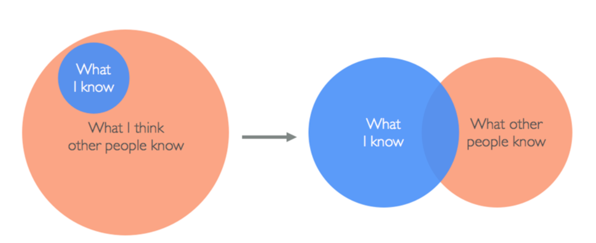
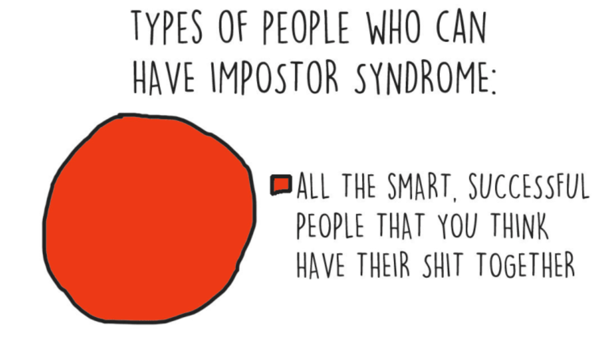

# What is Impostor Syndrome? 🤔

## The definition…

_The persistent inability to believe that one’s success is deserved or has been legitimately achieved as a result of one’s own efforts or skills._

## The short answer…

_Having the feeling that everyone around you is more knowledgeable, skilled or simply “better” than you._

## The long answer…

_Keep reading this article to find out._

In the above image, the left visualises the thoughts that someone with impostor syndrome experiences. However, these feelings are simply not true. What is more realistic is the thoughts on the right.

The reason why the right is more realistic is for a number of reasons, but can simply be put in one sentence…

> If you feel like someone else knows more than you but other people feel the same way about you then this makes us equal.

# Who Suffers? 🤔

It is said that 70% of people suffer with impostor syndrome at least once during their career.

Impostor syndrome can happen as early as during childhood. Children see adults acting differently to themselves. They’re allowed to go to bed later, they consume drinks (alcohol) which they’re not allowed and so on.

Only you know how you feel from the inside, yet we can only compare to other’s outside personas. What I mean by this is, people only show you what they want you to see. It’s only natural to show off your best side — no one is sharing when they did something wrong or failed to learn a new skill.

# Have you ever asked yourself? 🤔

✅ Am I smart enough to be in this job?

✅ Why did they hire me?

✅ Did I make a mistake choosing this career path?

✅ Is it even possible to learn the skills required?

✅ Am I just lucky?

If you’ve ever asked yourself any of the above, then the chances are you’ve had feelings of impostor syndrome.

I’ve personally asked myself all of these questions during my career. Without going into too much personal detail, I asked myself these questions in the order they appear. Here’s my story…

During my first job, I was surrounded by colleagues a lot older than myself and I naturally assumed that because someone is older, they are wiser. A few years later, I moved into a different position where I was subsequently made redundant after several years of a successful career move.

When I found a new job, I asked myself the second question. Being made redundant knocks your confidence and makes you feel worthless and hence I thought that I wasn’t good enough for the new job.

The new position required the ability to write some code — this was something I was capable of but not confident in doing. I wanted to do better. I taught myself how to write various programming languages in my spare time as well as incorporating the new skills into my work. This did wonders for my career and I then decided to move jobs again.

Wow, I landed the job as a **Software Development Engineer in Test** but then I wondered. I wondered if it would be possible to learn the skills to do the job but what I didn’t realise at the time was that I was already capable as I knew the skills but felt I needed to know more.

So now that leaves the last question — Am I just lucky?

# Types of Impostor Syndrome 👨‍👩‍👧‍👦

✅ The perfectionist

✅ The superwoman/man

✅ The natural genius

✅ The soloist

✅ The expert

According to studies, there are five types of impostor syndrome. Each have their own view and look on the feelings of impostor syndrome.

## The perfectionist

_Someone who seeks perfection or high goals and therefore never feels like they have achieved._

## The superwoman/man

_Someone who pushes themselves harder to measure up to their colleagues who they see as the real-deal. This can then have a negative impact on their personal life, hobbies or relationships._

## The natural genius

_Someone who finds something easy or doesn’t have to put much effort in. This individual will tend to feel shame if they don’t pick up a new skill quickly._

## The soloist

_Someone who feels like they can’t ask for help as it would be seen as a failure or that they must achieve a new skill without any help._

## The expert

_Someone who measures what or how much they know and fears being exposed as inexperienced or unknowledgeable._

# Why does it happen? 🤔

✅ Technology is evolving daily

✅ There is so much to learn and to choose from

✅ Unrealistic perceptions

✅ Technology can be competitive

You can often feel like you’ve learnt a piece of technology very well and then you find out there’s a newer version which changes some of the concepts or implementation methods. Therefore you think you haven’t achieved or your skills are not good enough.

Frontend? Backend? QA? React? Angular? Java? JavaScript? Python? Which one do you choose? The choices seem endless. Not forgetting the hype around different frameworks. You’ll always find an article online bad-mouthing a framework, which if you’ve just learnt or are very knowledgeable in that topic, it can make you feel like your skills are wasted.

I don’t know about you but my perception of someone who writes code is; young, wears a hoodie, sits in a dark room and eats pizza with no friends. It’s assumed by society that someone working in the technology industry is a geek. This simply isn’t the case at all. If you’ve ever worked in a room of programmers you’ll quickly understand that everyone is unique and has their own personalities & hobbies. Age, gender, race, sexual orientation — it doesn’t matter what your background is, you should feel accepted in your job.

Competitiveness is prevalent in the technology industry. Hackathons is just one example of this, you might hear that someone you know goes to these types of events all the time but you don’t. Alternatively you might write a piece of functionality in 50 lines of code, yet your colleague does it in 20 lines.

# Change your thinking 🤔

✅ Be comfortable being uncomfortable

✅ Everyone struggles

✅ Have strong drive

✅ Give yourself the credit you deserve

It’s okay to not understand something. People are always happy to help, you should never feel stupid asking a question.

As I’ve mentioned previously in this article, no one wants to show their weaknesses. Everyone struggles, they just don’t show it. Stop comparing to those around you.

If you’re passionate about something or want to achieve something then you must have a strong drive. Deep down, you know you can do it.

Just made a new website? Learnt how to write “Hello World” in a new programming language? Awesome, well done! You won’t always have someone telling you how far you’ve come.

# Keep going 💪

I’ve only recently found out what impostor syndrome is and it’s helped me in my career. I hope that this article helps you understand that you shouldn’t compare to other around you and that it’s okay to not understand something.

> If you’re wondering, it wasn’t just luck. I deserve all the things I’ve achieved. I worked hard for them — just like you have.

# Original Presentation 👇

This talk was originally presented at [Tray.io](https://tray.io) by [Thomas Chaplin](https://www.thomaschaplin.me)

[YouTube Video](https://youtu.be/a7-f5EaElL4)
