# Why would I want to build this?

Not only will you achieve a fully customisable automation workflow, you will realise that you can automate anything.

- Automation is fun
- No third party companies tracking your location
- No coding required
- Learn a new skill

# How do I build this?

## Install Tasker

- Open the Google Play store and search for Tasker or click on this link
- Tap Buy / Install

# Build the automation

## Open Tasker

Now that you have installed Tasker, go ahead and open the app. You will be presented with a blank screen as shown below.

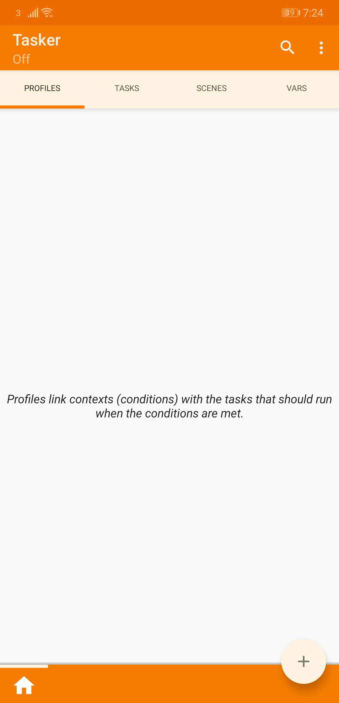

## Add a profile

Ensuring you are on the Profile tab, click on the ➕button in the bottom right corner. Upon clicking the ➕button you will see a context menu as shown below. Click on the **Event** option.

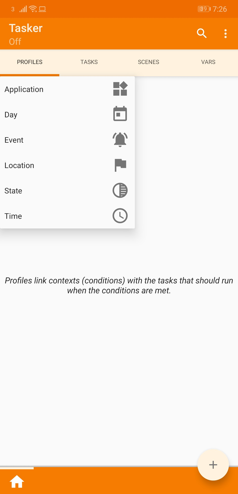

## Select Event Category

You will now be presented with the below modal. Then click on the option **Phone**.

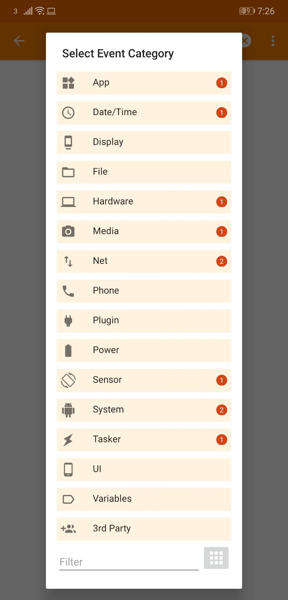

## Select Phone Event

Once you have clicked on the **Phone** option in the above step, you will be presented with the below modal. Now click on **Received Text** option.

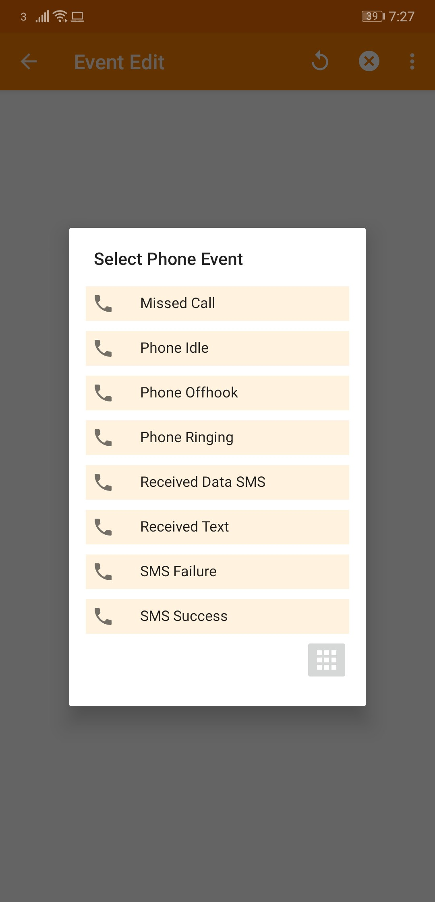

## Event Edit

You will now be presented with this form.

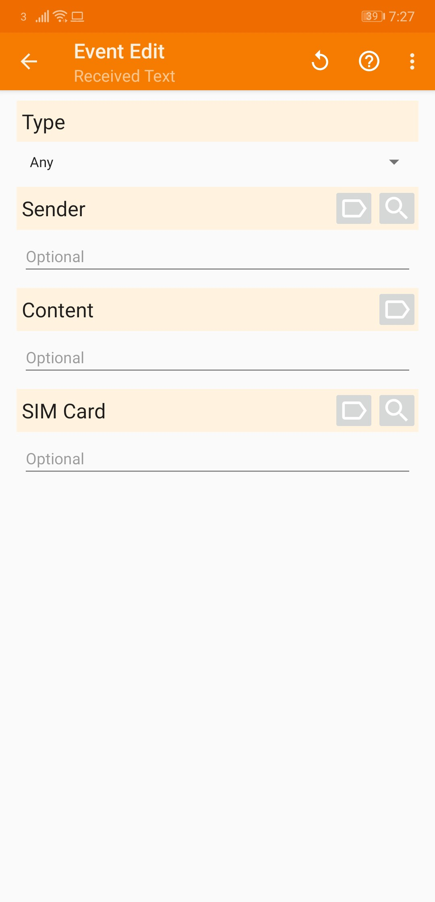

## Set Content

Now is the time you will need to choose a trigger word. In this example I’m using **#TRIGGER**. Set the content to the trigger message you want.

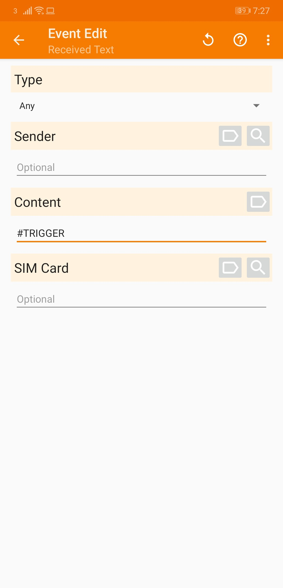

## Click Back

Once you have set the content, click the ⬅ arrow button in the top left.

## Add New Task

After clicking the ⬅ arrow button, you will see the below screen with **New Task**. Click on the ➕button.

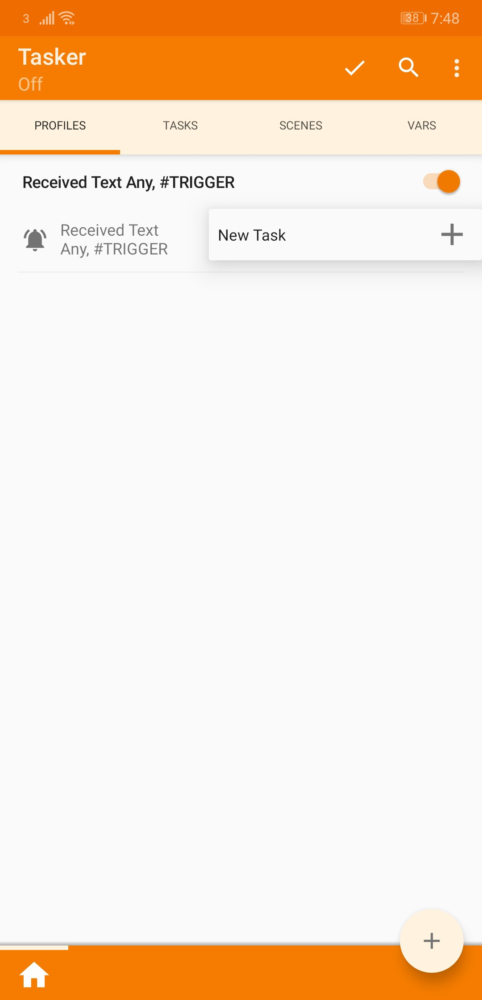

Then input a task name, for this example I have used **Send Location**. Then click on the ✔️button.

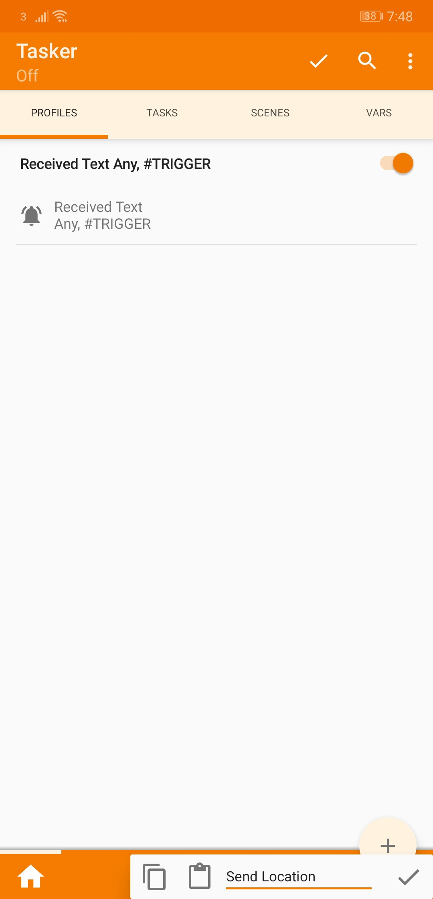

Now you will be presented with the below screen.

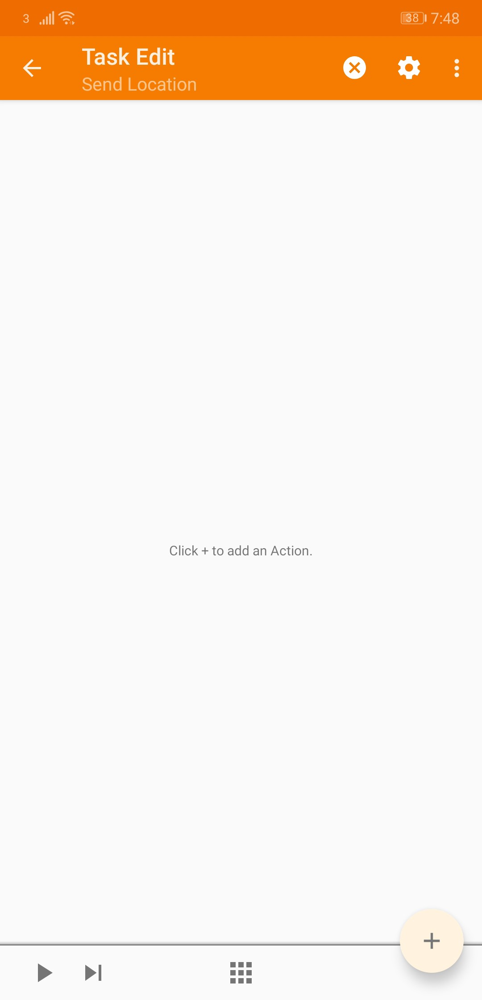

Click on the ➕button.

## Select Action Category

After clicking on the ➕button you will be presented with the below modal. Scroll down and click on the **Location** option.

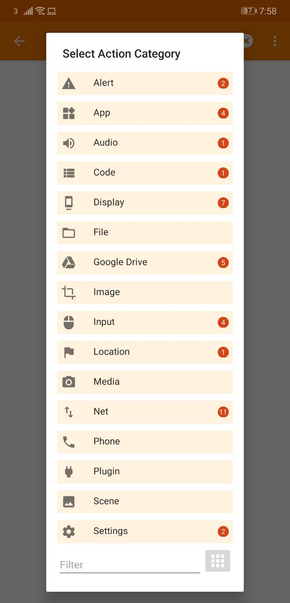

## Select Location Action

Now select the **Get Location v2** option in the below modal.

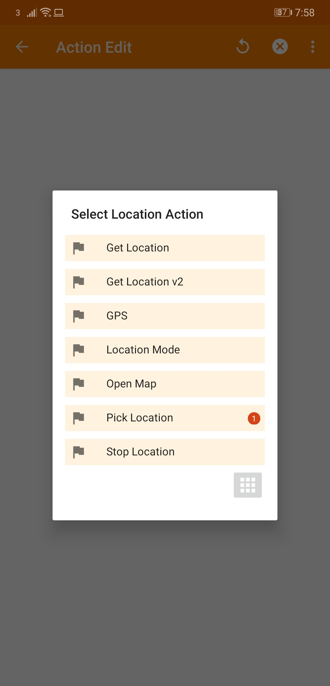

After clicking on the **Get Location v2** option, you will be presented with the below screen.

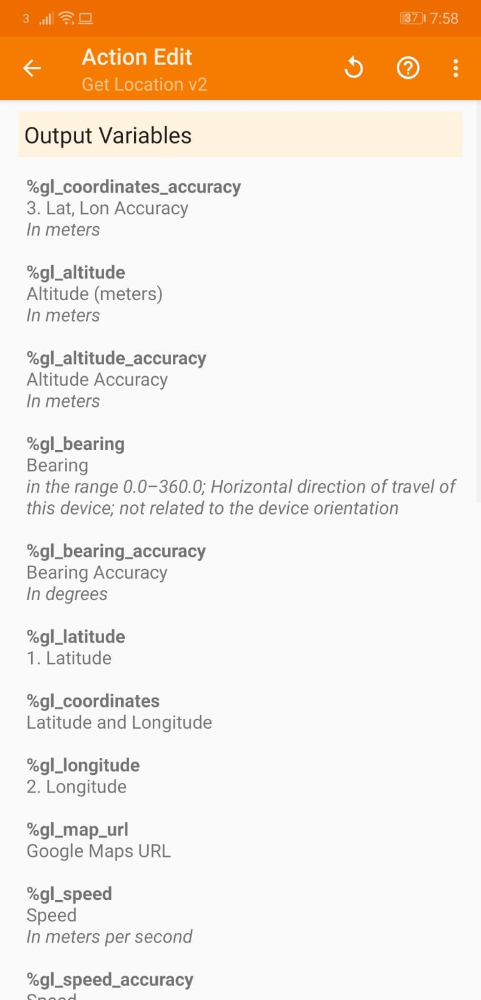

You can ignore this and click the ⬅ arrow button. Now you will see one task has been added.

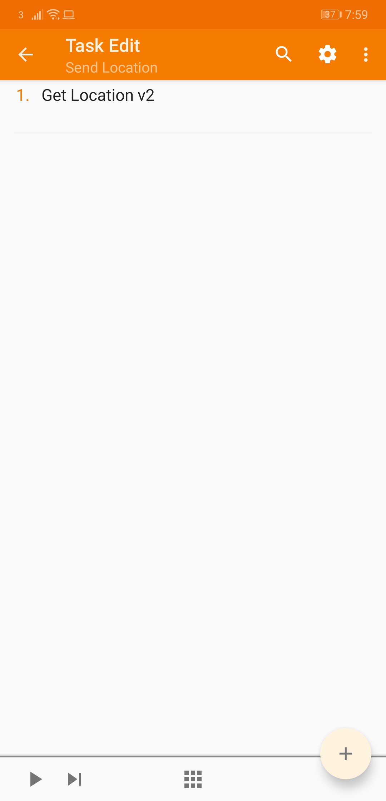

# Add New Task

Now we need to add the task to send the SMS message. Click on the ➕button in the bottom right. This time we want to pick **Phone**.

## Select Phone Option

Now select the Send SMS option.

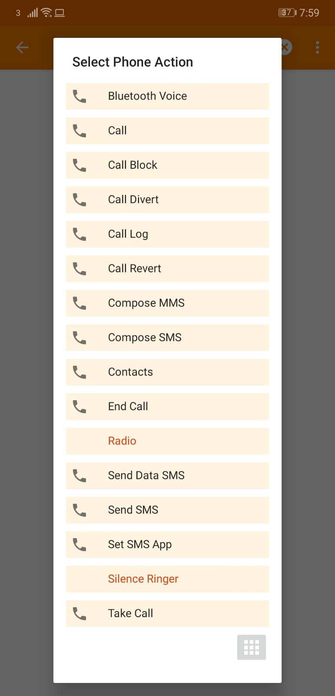

## Set Number & Message

Now set the number to **%SMSRF** and set the message to **%gl_map_url**.

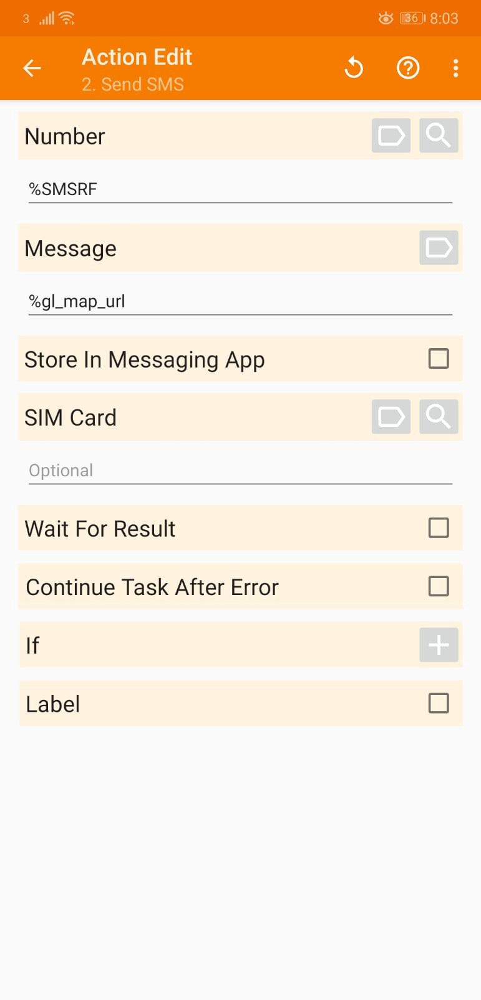

## Click Back

Now click on the ⬅ arrow button in the top left. You will then see we have two tasks showing.

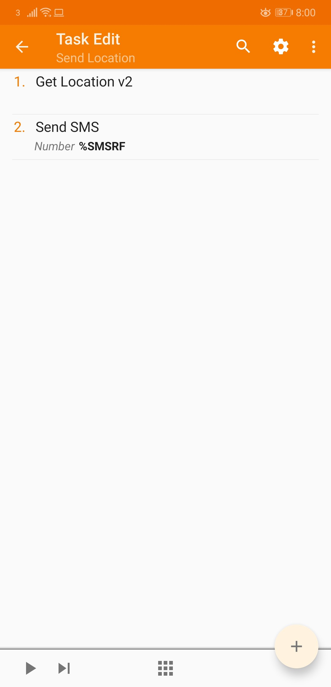

## Click Back

Now click the ⬅ arrow button again. You will see the completed workflow.

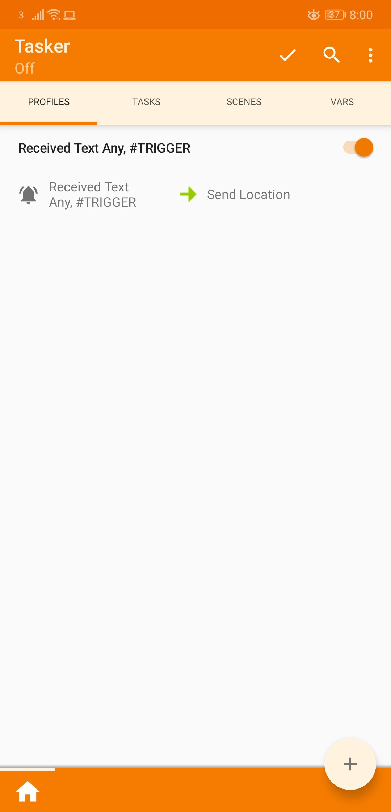

Now click on the ✔️button next to the magnifying glass to save the changes. Once you’ve done that, click on the ellipsis (…) button in the top right and click on **Enable Tasker**.

## Done

You have now successfully built the automation to handle the SMS trigger which will send the location of the device.

# Test the automation

- Open your SMS app.
- Send yourself a text message with the trigger message you chose i.e. #TRIGGER
- You should receive a text from yourself with the trigger message.
- You should then receive a text with a Google Maps link of the location of your device.

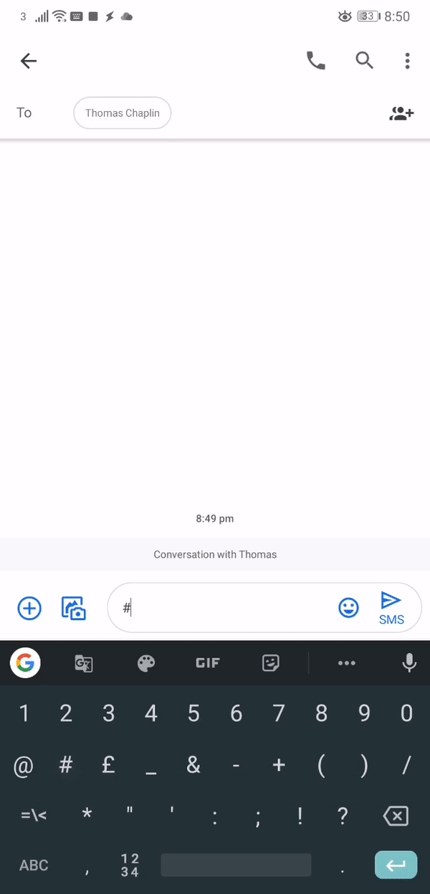

You will now be able to send your device a SMS with the trigger message from any mobile phone.

_Remember not to share the trigger word with anyone, otherwise they will be able to track you too!_

# Conclusion

In this blog post, we covered how to build automation that when a SMS message is received with a trigger word, it automatically replies with the location of the device. This can be used for tracking your mobile phone if you’ve lost it or someone has stolen it.

This was just one example of what you can automate with Tasker for Android. The possibilities are endless. Go and automate something!

If you want me to write up an article on how to automate something specific, leave a comment and let me know.

# Original Presentation 👇

This talk was originally presented at [Tray.io](https://tray.io) by [Thomas Chaplin](https://www.thomaschaplin.me)

[YouTube Video](https://youtu.be/CB28ogVLW5o)
